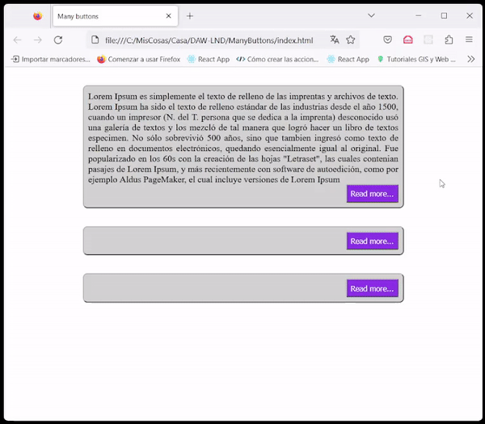

# Using getElementsByClassName

This project is just a use case for ```document.getElementsByClassName``` in the example shown below in a gif.




## Prerequisites

You need some HTML, CSS and JavaScript to understand the code.

You need a working environment with:
* [Git](https://git-scm.com) - You can install it from https://git-scm.com/downloads.

## To test this project just clone the project and clic twice on index.html

To test this project just clone the project:

```
git clone https://github.com/tcrurav/getElementsByClassName.git
```

and finally clic twice on index.html file.

Enjoy!!!


## Built With

* [Visual Studio Code](https://code.visualstudio.com/) - The Editor used in this project.


## Acknowledgments

* https://gist.github.com/PurpleBooth/109311bb0361f32d87a2. A very complete template for README.md files.
* https://www.conventionalcommits.org/en/v1.0.0/. A specification for adding human and machine readable meaning to commit messages.
* https://nvie.com/posts/a-successful-git-branching-model/. A successful Git branching model.
* https://learngitbranching.js.org/?locale=es_ES. A really funny game to learn Git branching.